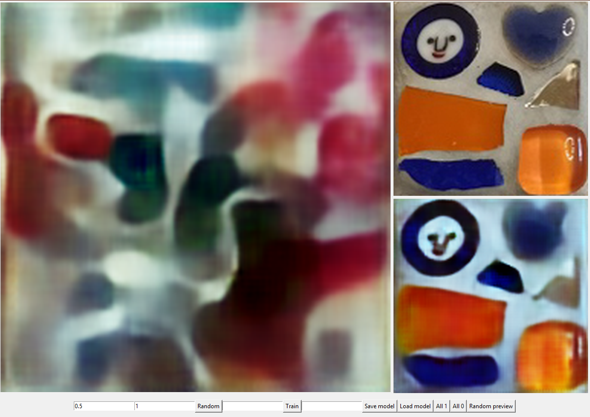

# Mosa-CNN (Projet terminé)
utilisation d'un CNN pour générer des motifs de mosaïques

# Introduction
Inspiré par le travail d'un membre de la famille, je me suis demandé s'il était possible d'utilsier un réseau de neurones pour générer des motifs de mosaïques.

# Cheminement
J'ai commencé par la création d'une interface avec tKinter pour visualiser facilement les images chargées et celles générées.
Ensuite, j'ai réfléchi sur la façon dont j'allais implémenter les structures de réseaux ainsi que les algorithmes essentiels à l'apprentissage. Ayant déjà travaillé sur des réseaux de neurones, je savais qu'il était très difficile de réimplémenter un réseau de neurones convolutif entièrement soi-même (J'ai implémenté entièrement un réseau de neurones simple, ie. linéaire, ce qui est moisn difficile).

Ainsi, je me suis tourné vers PyTorch, bibliothèque Python qui permet d'utilser les structures et algorithmes pré-implémentés tout en gardant une grande liberté sur la préparation et le déroulement de l'apprentissage.

# Autoencoder
Permièrement, j'ai utilisé un AutoEncoder, type de réseau spécialisé dans la génération d'images à partir de modèles par l'exraction de motifs, de schémas et de couleurs récurrents dans l'images.

Ce réseau prend en entrée une image et donen en sortie une image du même format. Entre l'entrée et la sortie, l'information est compressée, ie. on passe de environ 50k paramètres à 1024 puis on la décompresse pour reformer une image. Le but est que le réseau apprenne à compresser l'image de façon optimale, c'est-à-dire qu'il reconnaisse des patterns, des motifs, pour ensuite reformer l'image à partir de ces patterns.

Ci-dessus une image de l'interface. Sur la droite, en haut s'affiche une image exemple prise au hasard. En bas, à droite, est affichée l'image qui est retournée par le réseau apèrs avoir compressé puis décompressé cette même image. A gauche apparaît une image générée en utilisant la partie décompression du réseau. On met en entrée un vecteur aléatoire de 1024 flottants et l'image retournée s'affiche.

Ici, le réseau n'a encore rien appris, donc les images générées ne ressemble qu'à une sorte de bruit.

# Résultat

Après une session d'apprentissage (environ une heure sur GPU), le réseau est capable de compresser/décompresser une image de sorte à conserver ses principaux motifs. L'image en bas à droite, si elle n'est pas une copie exacte de l'image d'origine, en haut à droite, lui ressemble beaucoup et a les mêmes couleurs et motifs.

Sur la gauche on peut voir une image aléatoire, générée à partir des motifs appris par le réseau. On peut observer que, si cette image fait bien apparaître des motifs colorés distincte, elle n'est pas très intéressante car trop "brouillon".

Malgré plusieurs changement d'architecture du réseau, je n'ai pas réussi à obtenir des images plsu interessantes.

# GAN
J'ai aussi tenté une autre approche, celle d'un GAN (Generative Adverserial Network), qui fonctionen sur le principe d'un double réseau. L'un génère des images et l'autre les discrimine. Dans l'idéal, les deux réseaux évoluent en même temps, le premier apprenant à faire des images de plus en plsu ressemblantes aux images-exemples et le second apprenant à discriminer les images générées des images-exemples de mieux en mieux. 

Malheureusement, dans mon cas, cette approche n'a rien donné, les images générées étant systématiquement inexploitables et ssans intérêt.
